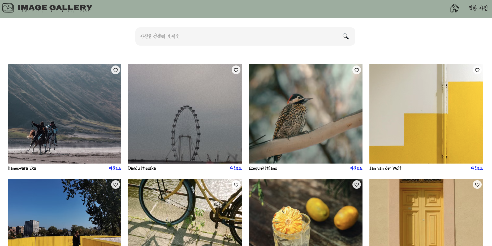
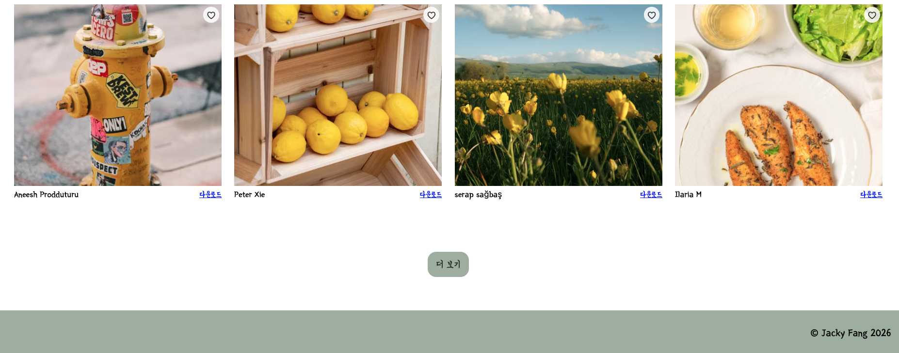
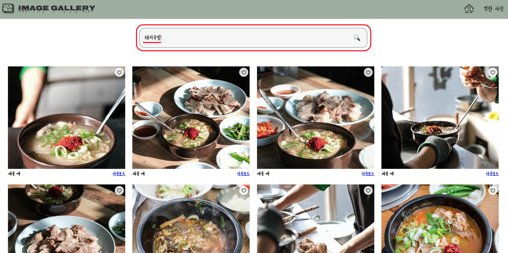
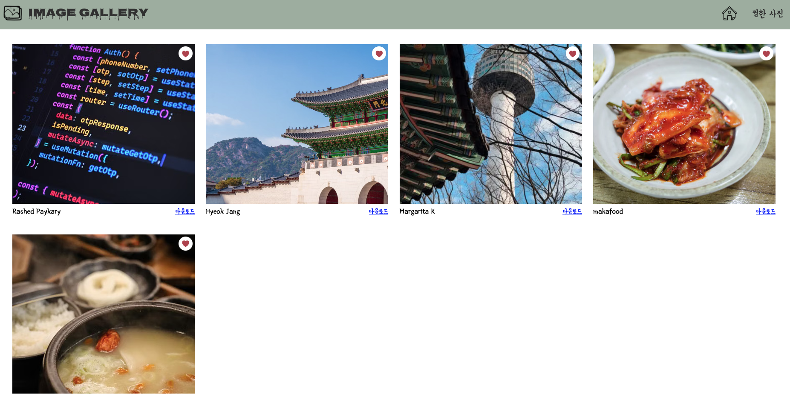
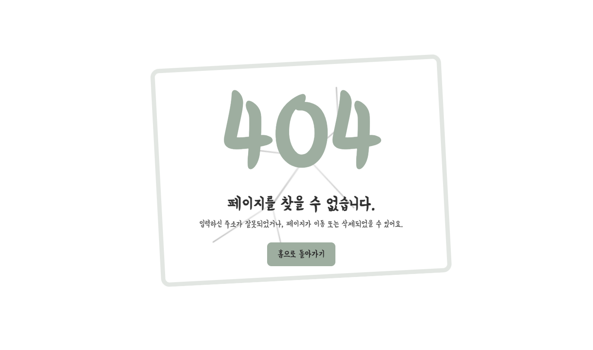

# 🖼️ Image Discovery Platform

## [Visit the Website](https://jackyfang-image-gallery-website.netlify.app/)

## Overview

This project is an image search website built with React. It uses the Pexels API to provide a large collection of high-quality images, allowing users to search for images based on keywords.

The homepage randomly loads curated images from Pexels. Users can enter keywords to search for images and use the “Load More” feature to view additional search results. Each image displays photographer information and includes a link to the original image, making it easy for users to view or download it.

Users can also add their favorite images to a favorites list. Favorite data is stored in the browser’s localStorage, so saved images remain available even after refreshing the page.

The project includes a homepage, favorites page, and custom 404 page, providing a complete single-page application browsing experience.

## Tech Stack

- Frontend:`JavaScript`, `HTML`, `CSS`, `React`, `React Router DOM`, `JSX`
- Deployment Platform: `Netlify`
- External API：`Pexels API`

## Page Preview

#### Home Page:

#### Image Search Page:

#### Favorites Page:

#### Custom 404 Page:

